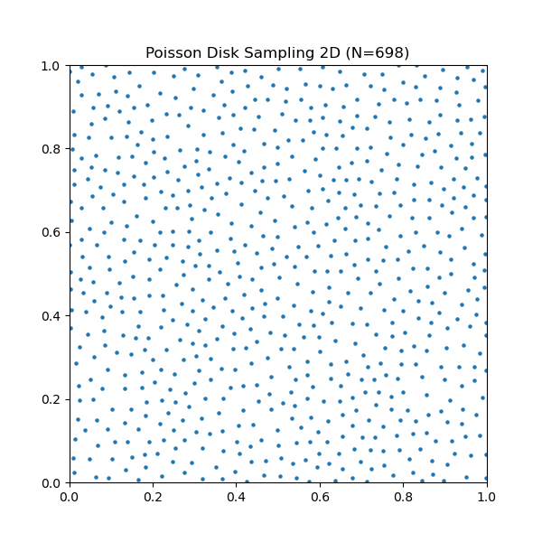
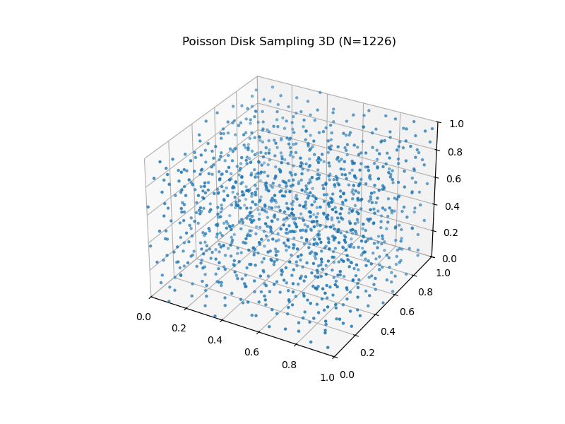
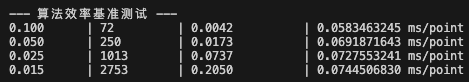
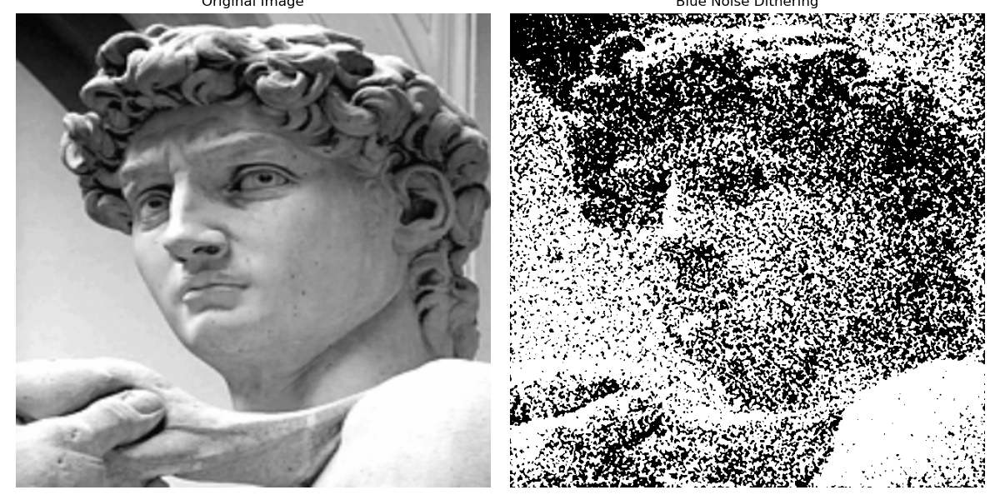

# 泊松盘采样算法：复现、高效性证明及在数字半色调中的应用
## 第一部分：算法选题与理论核心
### 1. 核心算法：泊松盘采样 (Poisson Disk Sampling)
本实验的核心研究算法是泊松盘采样算法 这是一种在二维或高维空间中生成随机点集的方法,其核心约束是：任意两个采样点之间的距离不得小于给定的最小半径 $r$ 
相比于完全随机的均匀采样,泊松盘采样生成的点集具有蓝噪声频谱特性 这意味着点集在空间分布上是低频上能量比较低,高频上能量比较高,比较符合人的观察,这种特性使其成为计算机图形学、渲染和纹理生成中有广泛应用 
### 2. 算法复现目标
本次实验旨在复现 Rober Bridson 提出的高效泊松盘采样算法,并验证其以下特性：
*   蓝噪声特性：生成的点分布应具有各向同性,且无低频团块 
*   线性时间复杂度：算法应能以 $O(N)$ 的效率生成 $N$ 个点,证明其高效性 
*   
## 第二部分：算法实现与复现细节
### 1. 核心算法实现逻辑
复现了基于网格加速的泊松盘采样算法,具体算法步骤如下：
1.  **网格初始化**：将采样空间划分为网格,网格大小设为 $r/\sqrt{d}$,其中d代表的是维度数,这样可以保证在一个单元(2D是1 * 1正方形,3D是1* 1 *1正方体) 这保证了每个网格单元内最多只能存在一个采样点,大大加速了冲突检测 
2.  **初始点生成**：随机选择一个初始点放入活跃列表即Active List 
3.  **扩散采样**：
    *   从活跃列表中随机选取一个点 $P$ 
    *   在 $P$ 周围的圆环区域（半径 $r$ 到 $2r$ 之间）随机生成 $k$ 个候选点（本实验中取 $k=30$） 
    *   检查候选点是否与现有网格中的点冲突（距离 $<r$） 
    *   此处需要注意的是由于面积和体积与半径并不是成线性关系,故而在二维采样和三维采样的时候应当在面积和体积上进行随机采样,否则会导致采样个并不均匀
4.  **状态更新**：若找到有效点,将其加入网格和活跃列表；若尝试 $k$ 次后无有效点,将 $P$ 从活跃列表中移除 

    
    
     
    
图：二维采样结果 (左) 与 三维采样结果 (右)

### 2. 辅助处理
一开始生成的点是离散的点,然而对于图像处理这显然是不可行的,因此设计了一个简单的转换算法：
*   **栅格化**：将连续坐标的点映射为离散像素网格 
*   **高斯场构建**：利用高斯滤波（$\sigma=1.5$）将离散点转化为连续的能量势场 
*   **直方图均衡**：将势场归一化为概率均匀分布的阈值矩阵,作为下游任务的输入 
  
## 第三部分：算法高效性证明 (Efficiency Validation)
本部分通过理论分析与实验数据,证明复现的泊松盘采样算法及其下游应用的高效性 
### 1. 采样生成的高效性 (Generation Efficiency)
**理论复杂度证明：$O(N)$**

我们要证明生成 $N$ 个采样点的时间复杂度是线性的,即证明生成任何一个新点的平均计算开销是常数时间 $O(1)$ 
1.  网格优化的关键性：
    *   算法维护了一个背景网格,单元格尺寸为 $\frac{r}{\sqrt{d}}$（$d$为维度） 根据几何原理,该尺寸下网格对角线长度为 $r$ 
    *   这意味着：任意一个网格单元内,最多只能存在一个采样点 如果存在两个点,它们的距离必然小于 $r$,这违背了泊松盘采样的定义 
    *   因此,在检查一个候选点是否与现有点冲突时,我们不需要遍历所有已生成的点（否则复杂度为 O(N)）,而只需要检查该候选点所在的网格单元及其周围的邻域单元 在二维空间中,这是 5*5 = 25 个单元格；在三维空间中是 $3^3$ 或 $5^3$ 数量级的单元格 
    *   由于每个单元格最多包含 1 个点,邻域搜索的开销是严格的常数时间O(1) 
2.  **活跃列表的处理 (Active List)**：
    *   算法核心是随机选取活跃点 $P_i$ 并尝试在其周围生成k个候选点 
    *   每个最终生成的点P,都会且仅会进入活跃列表一次 
    *   当一个点在列表中时,我们会对其进行最多k次尝试 
    *   一旦k次尝试失败,该点被移出列表,且永远不会再被放回 
3.  **总运算量统计**：
    $$ T_{total} \approx \sum_{i=1}^{N} (k \times T_{check}) $$
    *   $T_{check}$：冲突检测时间 由第一点可知,基于网格哈希,$T_{check} = O(1)$ 
    $$ \therefore T_{total} = N \times k \times O(1) = O(N) $$
**结论**：该算法避免了随着点数增加而导致的“搜索爆炸”问题,无论 $N$ 多大,生成第 $N$ 个点的难度与生成第 1 个点几乎相同,因此具有严格的线性时间复杂度 
*   **实验数据验证**：如图所示,随着点的数量增加,每个点所需要的时间是基本不变的

    

## 第四部分：下游任务应用 (Downstream Tasks)

我们将泊松盘采样生成的蓝噪声应用到了以下三个具体任务中：
### 应用任务 1：基于蓝噪声的有序抖动
*   **任务描述**：这是本算法最主要的应用 利用采样生成的均匀噪声图作为阈值矩阵,将灰度图转换为黑白图 
*   **实验结果**：
    *   对 `david.jpg` 的处理结果显示,人脸光影过渡自然,发丝等高频细节保留完好 
    *   **优势体现**：证明了泊松盘采样生成的蓝噪声能有效将量化误差推向高频,利用人眼视觉特性隐藏噪点,虽然实现的效果比lab1中给的蓝噪声图的效果要差一些,但是也比白噪声的结果要好一些,毕竟这只是一个二十年前的O(N)复杂度算法 

    

### 应用任务 2：程序化纹理与分布生成
*   **任务描述**：泊松盘采样的原始输出可直接用于游戏开发或设计中的物体散布（如植被生成、UI元素排布） 
*   **理论应用**：通过 `poisson_disk_sampling_2d` 函数直接获取坐标点 相比于伪随机生成,由于具有 $r$ 的最小距离约束,生成的分布永远不会出现物体得太近而穿模的问题,大大减少了碰撞检测的开销 

## 第五部分：总结
本次实验成功复现了泊松盘采样算法,并以此为核心解决了多个下游问题 
1.  **算法本身**：通过网格加速策略,实现了线性时间复杂度的点集生成,确保了在大规模数据下的运行效率 
2.  **下游应用**：将采样结果转化为蓝噪声掩膜,成功应用于图像处理领域 

该实验证明,泊松盘采样不仅是一个高效的数学工具,更是连接高质量渲染与低算力/低位深设备之间的关